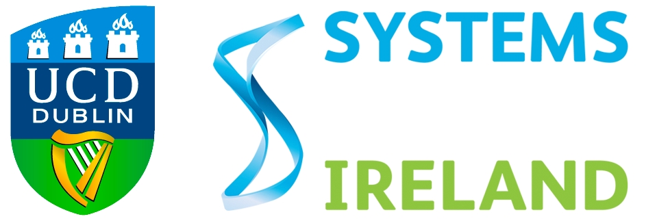

# About
I am a PhD student in [Systems Biology Ireland](https://www.ucd.ie/sbi/) as part of the [Centre for Research Training (CRT) Genomics Data Science](https://genomicsdatascience.ie/) programme, co-funded by the European Commission’s Marie Sklodowska Curie Actions (MSCA) COFUND programme. 

My work involves finding molecular vulnerabilities in high-risk pediatric leukemia through biological network analysis. I am interested in exploiting omics data to better understand childhood leukemia to aid in the development of better treatments. 

I am currently part of the [Bond](https://www.ucd.ie/sbi/team/groups/bondgroup/) and [Ryan](https://www.ucd.ie/sbi/team/groups/ryangroup/) groups in [SBI, UCD](https://www.ucd.ie/sbi/).

<!---
a-clean-theme.svg)
--->

<h2><i class="fa fa-graduation-cap"></i> Background</h2>

<table class="table table-hover">
            <tr>
              <td>  
               
</td>
              <td><b>PhD student, Systems Biology Ireland, UCD </b>  2020 - present  Identifying molecular vulenarabilities in childhood leukaemia through biological network analysis.</td> </tr>
              <tr>
              <td> </td>
              <td><b>MSci Hons Genetics </b>  2016 - 2020   Awarded a first class MSci Hons degree in Genetics. </td> </tr>
</table>
                

<h2><i class="fas fa-microscope"></i><i class="fas fa-laptop-code"></i> Projects</h2>
<table class="table table-hover">
              <tr>
              <td>  
               
</td>
              <td><b>PhD student, Systems Biology Ireland, UCD </b>  2020 - present  Identifying molecular vulenarabilities in childhood leukaemia through biological network analysis.</td> </tr>         
              <tr>
              <td> </td>
              <td><b>Masters project </b>  Sep 2019 - May 2020   Supervisor: [Prof John Armour](https://www.nottingham.ac.uk/life-sciences/people/john.armour)   Studied copy-number variations in the human genome using by Nanopore reads.   Developed a pipeline that can identify copy-number variants and separate the two haplotypes based on read depth and read length.  </td> </tr>
              <tr>
              <td> </td>
              <td><b>Summer internship </b>   Jun 2019 - Aug 2019   
                          Supervisor: [Dr Martin Gering](https://www.nottingham.ac.uk/life-sciences/people/martin.gering) 
                            
                          Worked on zebrafish mutant embryos to investigate how the expression of macrophage marker genes changes over different time-points post fertilisation.   Acquired an insight into the areas of developmental biology and gene regulation.   Methods used: embryo handling, RNA in-situ hybridization, PCR and light microscopy. </td> </tr>
</table>

<h2>Presentations</h2>

The theme can be used with GitHub Pages by setting the `remote_theme` in your Jekyll sites `_config.yml`

<!---## Documentation
For full instructions, please see the [Documentation](/bulma-clean-theme/docs/)
## Page Layouts
This demo site showcases the available page layout options. 
* Sidebar
* Menubar
* Tabs
* Footer
* Hero
* Contents
* Landing Page With Callouts
* Sponsors Page
* Image Gallery
* Recipe Page
* Blog
* Post--->
