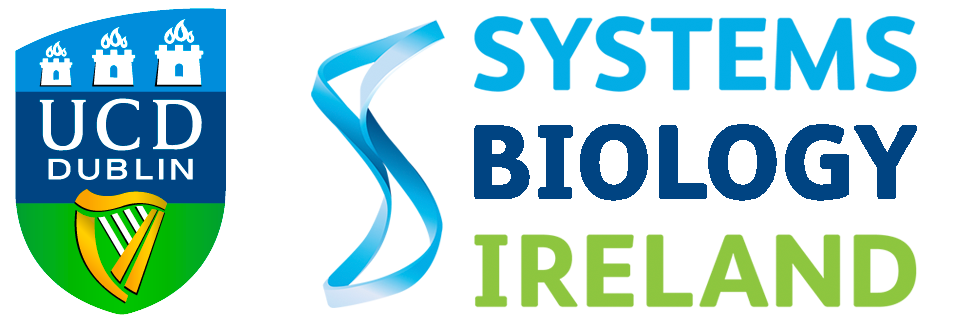

# About
I am a PhD student in [Systems Biology Ireland](https://www.ucd.ie/sbi/) as part of the [Centre for Research Training (CRT) Genomics Data Science](https://genomicsdatascience.ie/) programme, co-funded by the European Commission’s Marie Sklodowska Curie Actions (MSCA) COFUND programme. 

My work involves finding molecular vulnerabilities in high-risk pediatric leukemia through biological network analysis. I am interested in exploiting omics data to better understand childhood leukemia to aid in the development of better treatments. 

I am currently part of the [Bond](https://www.ucd.ie/sbi/team/groups/bondgroup/) and [Ryan](https://www.ucd.ie/sbi/team/groups/ryangroup/) groups in [SBI, UCD](https://www.ucd.ie/sbi/).


<!---[](https://badge.fury.io/rb/bulma-clean-theme)
a-clean-theme.svg)
--->


<div class="row" id="background" markdown="1">
  <div class="col-lg-12 col-md-12 col-sm-12">
    <h2><i class="fa fa-graduation-cap"></i> Background</h2>
      <table class="table table-hover">
            <tbody>
            <tr>
              <td>    
                
</td>
              <td><b>PhD student, Systems Biology Ireland, UCD </b>  
                2020 - present  <br>
                Identifying molecular vulenarabilities in childhood leukaemia through biological network analysis.</td>
            <tr>
              <td> 
</td>
              <td><b>MSci Hons Genetics </b> 
                2012 - 2016  <br>
                Awarded a first class MSci Hons degree in Genetics. </td>
              </tr>
  </tbody>
</table>
</div>
</div>


| |  | |
--- | --- | ---|
|data1|data2|data3|
|data11|data12|data13|
              
<h2> Presentations </h2>

The theme can be used with GitHub Pages by setting the `remote_theme` in your Jekyll sites `_config.yml`


<h2> Projects </h2>
```yml
remote_theme: chrisrhymes/bulma-clean-theme
```

<!---## Documentation

For full instructions, please see the [Documentation](/bulma-clean-theme/docs/)

## Page Layouts

This demo site showcases the available page layout options. 

* Sidebar
* Menubar
* Tabs
* Footer
* Hero
* Contents
* Landing Page With Callouts
* Sponsors Page
* Image Gallery
* Recipe Page
* Blog
* Post--->

